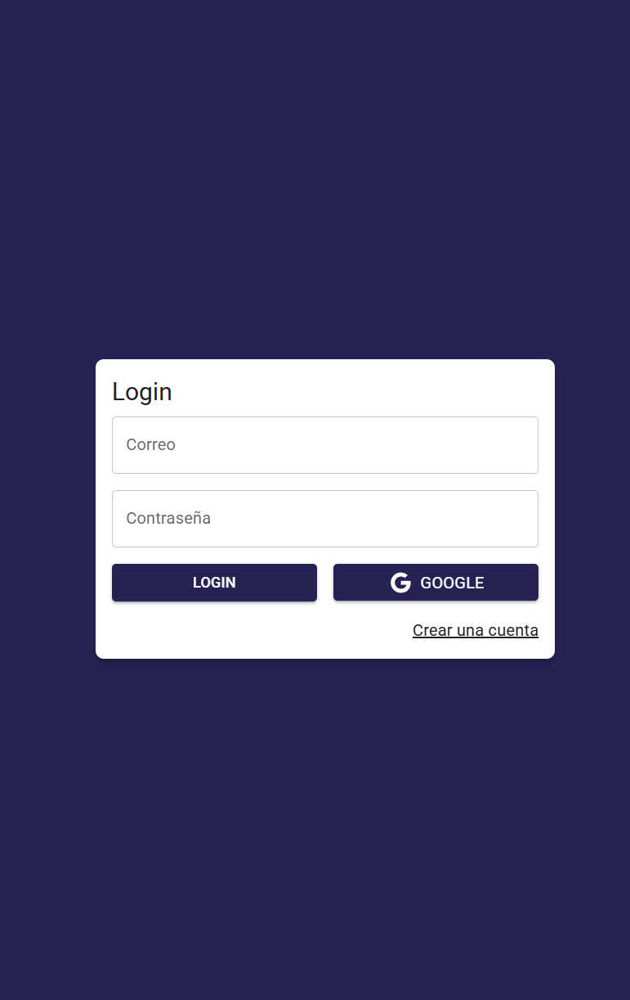
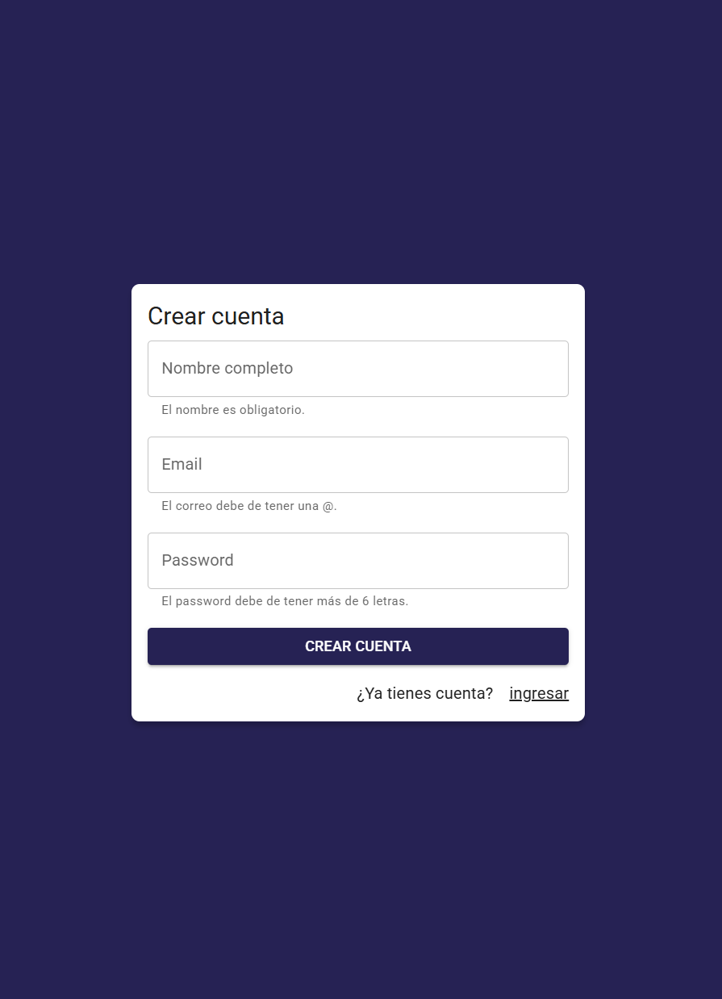
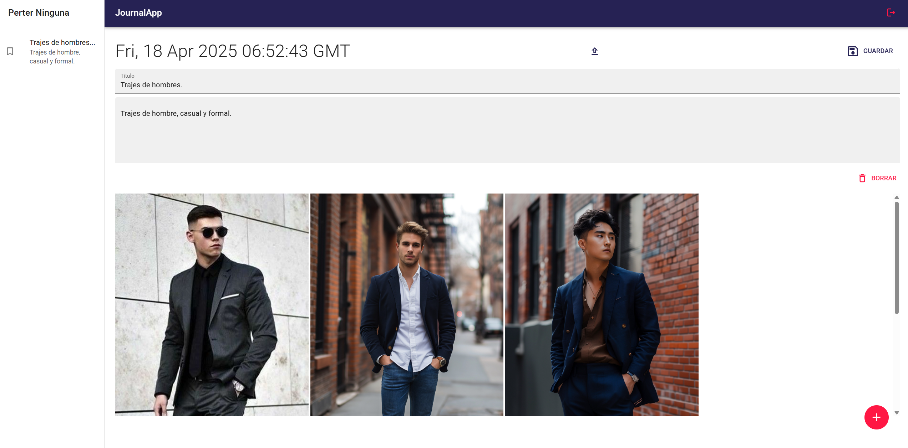

# 📓 JournalApp

**JournalApp** es una aplicación web para la gestión de notas personales. Cada nota puede contener un título, una descripción y opcionalmente una imagen (las cuales se almacenan en [Cloudinary](https://cloudinary.com/)). Permite a cualquier usuario crear, editar, eliminar y leer notas de manera sencilla y eficiente.

Este proyecto tiene como propósito principal demostrar las habilidades del autor como desarrollador, integrando tecnologías modernas del ecosistema React y una arquitectura robusta basada en Redux Toolkit y Firebase.

👉 [Ver la aplicación en línea](https://journal-app-luisd6b2s-projects.vercel.app/#/auth/login)

---

## 🚀 Funcionalidades

- Crear nuevas notas con título, descripción e imagen (opcional).
- Editar notas existentes.
- Eliminar notas.
- Visualizar todas las notas creadas.
- Subida de imágenes con integración a Cloudinary.
- Manejo de estados globales con Redux Toolkit.
- UI moderna con Material UI.

---

## 🛠️ Tecnologías Utilizadas

- **React** – Framework principal para construir la interfaz de usuario.
- **Redux Toolkit** – Manejo del estado global de manera eficiente.
- **Firebase** – Autenticación, almacenamiento y base de datos en tiempo real.
- **Cloudinary** – Almacenamiento y manejo de imágenes.
- **React Router DOM** – Navegación entre rutas.
- **Material UI** – Componentes visuales modernos y accesibles.
- **SweetAlert2** – Alertas elegantes y personalizadas.
- **Vite** – Herramienta de desarrollo para un entorno rápido y moderno.
- **ESLint** – Linter para mantener un código limpio y consistente.

---

## 🔧 Scripts Disponibles

```bash
npm run dev        # Inicia la app en modo desarrollo
npm run build      # Genera una versión optimizada para producción
npm run preview    # Sirve la app ya construida
npm run lint       # Ejecuta ESLint sobre el código fuente
```

---

## 📦 Instalación

1. Clona el repositorio:
```bash
git clone git@github.com:LuisD6/Journal-App.git
cd journal-app
```

2. Instala las dependencias:
```bash
npm install
```

3. Crea y configura tu archivo `.env` con las credenciales de Firebase y Cloudinary. Usa el .env.example, renombralo como .env y agrega tus credenciales.

4. Ejecuta la aplicación:
```bash
npm run dev
```

---

## 📸 Capturas de Pantalla

### 🟢 Pantalla de Inicio de Sesión


### 🟢 Pantalla de crear cuenta


### 🗂️ Pantalla Principal de Notas



---

## 🧑‍💻 Autor

Desarrollado por Casarez.  
Este proyecto fue creado con el objetivo de demostrar conocimientos técnicos en el desarrollo web moderno Full Stack.

---

## 📄 Licencia

Este proyecto es de código abierto y se publica bajo la licencia [MIT](LICENSE).

---

## 🌐 English Summary

**JournalApp** is a web application that allows users to manage personal notes. Each note can include a title, description, and optionally an image uploaded to Cloudinary. The app supports creating, editing, reading, and deleting notes. It is designed to demonstrate the technical skills of the developer using technologies like React, Firebase, Redux Toolkit, and Material UI.
